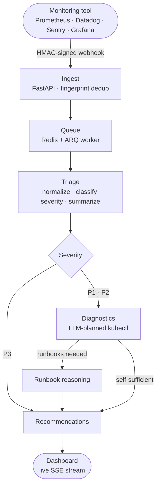

<div align="center">

# Autage

**Autonomous AI SRE copilot for your production cluster.**

Autage ingests alerts from any monitoring tool, triages them with LLMs, runs
agentic kubectl diagnostics, cross-references your runbooks, and hands on-call
engineers concrete remediation steps — streamed live to a dashboard.

[](https://www.python.org)
[](https://fastapi.tiangolo.com)
[](https://www.langchain.com/langgraph)
[](https://www.postgresql.org)
[](https://redis.io)
[](https://react.dev)
[](LICENSE)

</div>

---

## How it works



Every LLM step in the pipeline — triage, diagnostics, runbook reasoning,
recommendations — can run on a **different provider and model**, chosen by you.

## Why Autage

- **Zero per-source parsing** — alerts arrive as raw JSON from any tool; the LLM
  normalizes them at triage time.
- **Agentic, not scripted** — the model decides *which* kubectl commands to run,
  reads the output, and reasons over it like an SRE would.
- **Your runbooks matter** — upload markdown runbooks; Autage consults the right
  sections mid-incident and connects them to the observed evidence.
- **Bring your own LLM** — Gemini, OpenAI, Anthropic, OpenRouter, or local
  Ollama. Route a fast model to triage and a stronger one to recommendations.
- **Self-hosted and private** — your cluster, your keys, your data.

## Quick start

**Prerequisites** — Python 3.13 with [uv](https://docs.astral.sh/uv/), Docker,
Node 20+.

```bash
# 1. Clone and install
git clone https://github.com/va18hav/Autage.git && cd Autage
uv sync

# 2. Infrastructure (Postgres + Redis)
docker compose up -d

# 3. Environment
cp .env.example .env
# Generate a master key for credential encryption:
uv run python -c "from cryptography.fernet import Fernet; print(Fernet.generate_key().decode())"

# 4. Database schema
uv run alembic upgrade head

# 5. Run the stack (three terminals)
uv run uvicorn services.http.app:app --reload          # API
uv run arq services.worker.main.WorkerSettings          # Agent worker
cd services/dashboard && npm install && npm run dev     # Dashboard
```

Open **http://localhost:5173** → **Settings** → add a provider API key and pick
your models → then fire a test alert:

```bash
uv run python scripts/send_mock_alert.py
```

Watch the incident triage live on the dashboard as each pipeline step streams in.

## Model configuration

| Step | What the model does |
|---|---|
| **Triage** | Normalizes the raw alert, classifies P1–P3, writes the summary |
| **Diagnostics** | Plans and executes kubectl commands, summarizes the evidence |
| **Runbook reasoning** | Selects relevant runbook sections, reconciles them with findings |
| **Recommendations** | Produces the final ordered remediation steps |

Configure providers, API keys, and per-step models in the dashboard's
**Settings** page. Keys are Fernet-encrypted at rest and never returned by the
API — the UI only ever sees a masked preview. No key configured? Autage falls
back to Gemini via `GOOGLE_API_KEY` in `.env`.

## Tech stack

| Layer | Tool |
|---|---|
| Agent orchestration | LangGraph + LangChain |
| LLM providers | Gemini · OpenAI · Anthropic · OpenRouter · Ollama |
| API | FastAPI |
| Worker | ARQ (Redis-backed task queue) |
| Database | PostgreSQL (async SQLAlchemy 2 + Alembic) |
| Dashboard | React 19 · Vite · Tailwind · shadcn/ui · TanStack Query |
| Runtime | Python 3.13 · uv |

## Project structure

```
services/
├── agent/            # LangGraph pipeline
│   ├── nodes/        #   triage · fetch_logs · refer_runbooks · recommended_steps
│   ├── prompts/      #   node prompts
│   ├── tools/        #   kubectl dispatcher · runbook tools
│   └── llm/          #   provider registry · per-step model resolver
├── secrets/          # Credential encryption (Fernet) + store
├── db/               # SQLAlchemy models + async engine
├── http/             # FastAPI routes (webhooks, incidents, runbooks, settings)
├── worker/           # ARQ worker — runs the graph per incident
└── dashboard/        # React SPA
```

## Roadmap

- [ ] Human-in-the-loop approval gate before executing remediation actions
- [ ] Action execution (scale, rollback, restart) behind approval
- [ ] First-class integrations (Slack, PagerDuty) on the shared credential store
- [ ] Authentication & roles (first user becomes admin)

---

<div align="center">

**Autage** — your on-call never starts from a blank terminal again.

Released under the [Apache License 2.0](LICENSE).

</div>
