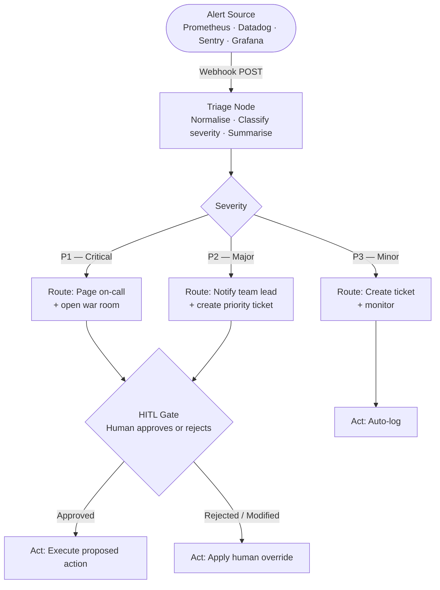

# Autage

> Autonomous AI SRE copilot. Ingests production alerts, triages severity, diagnoses incidents, and proposes remediation — pausing for human approval before executing anything in production.

---

## How it works



---

## Alert sources

Autage accepts raw alert payloads from any monitoring tool over a webhook. The triage node uses an LLM to normalise the payload — no per-source parsing code required.

| Source | Format | Status |
|---|---|---|
| Prometheus Alertmanager | JSON webhook | Supported |
| Datadog | JSON webhook | Supported |
| Grafana OnCall | JSON webhook | Supported |
| Sentry | JSON webhook | Supported |
| PagerDuty | JSON webhook | Supported |

---

## Severity levels

| Level | Meaning | Example |
|---|---|---|
| **P1** | Critical — service down or full outage | OOM kills causing pod crash loop in production |
| **P2** | Major — degraded but not fully down | 40% error rate on payment service |
| **P3** | Minor — informational, no user impact | Memory usage trending up, not yet at threshold |

---

## Human-in-the-loop (HITL)

Autage never executes a write action in production without human approval. The graph pauses at the HITL gate, presents the proposed action, and waits for a response.

- **P1 / P2** — always requires explicit approval before acting
- **P3** — auto-logs; no human gate needed
- A human can approve, reject, or override with a different action at the gate

This is implemented using LangGraph's `interrupt()` primitive with a persistent checkpointer, so the graph state survives across process restarts.

---

## Tech stack

| Layer | Tool |
|---|---|
| Agent framework | [LangGraph](https://github.com/langchain-ai/langgraph) |
| LLM | Gemini 2.5 Flash via `langchain-google-genai` |
| Alert ingestion | FastAPI webhook endpoint |
| Data validation | Pydantic v2 |
| State persistence | LangGraph checkpointer (SQLite → Postgres) |
| Package manager | [uv](https://github.com/astral-sh/uv) |
| Runtime | Python 3.13 |

---

## Project structure

```
services/
└── agent/
    ├── state.py          # AgentState, Severity enum
    ├── graph.py          # Graph assembly and compilation
    ├── main.py           # Entry point
    ├── nodes/
    │   ├── triage.py     # Normalise alert, classify severity
    │   ├── route.py      # Map severity to proposed action
    │   ├── hitl.py       # Interrupt graph, await human decision
    │   └── act.py        # Execute approved action
    └── prompts/
        └── triage.py     # LLM prompt for triage node
```

---

## Getting started

```bash
# Install dependencies
uv sync

# Configure environment
cp .env.example .env
# Add GOOGLE_API_KEY to .env

# Run against a live webhook or a local alert payload
uv run python -m services.agent.main
```

---

## Current build status

| Node | Status |
|---|---|
| Triage | Done |
| Route | In progress |
| HITL Gate | Not started |
| Act | Not started |
| FastAPI webhook | Not started |
